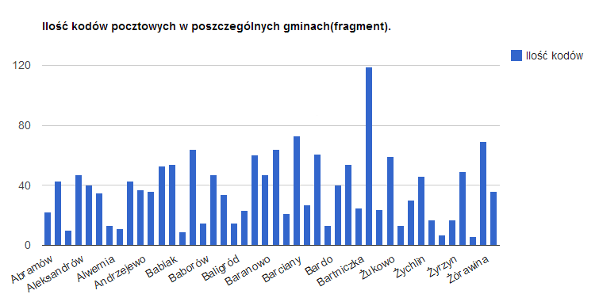

# *Jan Szewczak, 186414*
---
## Wykorzystana baza db.kody_pocztowe
### została ona pobrana na mój serwer mongodb

## Map reduce

### Ilość kodów pocztowych w poszczególnych gminach.

### Funkcja map

```js
var map = function() {
    emit({gmina: this.gmina}, { count: 1 });
}; 
```

### Funkcja reduce

```js
var reduce = function (key, values) {
    var count = 0;
    values.forEach(function (v) {
        count += v['count'];
    });
    return {count: count};
};
```

### Wywołanie mapReduce

```js
db.kody_pocztowe.mapReduce(map,reduce,{ out : 'gminy'})
```

### [Plik JS z komendami](/scripts/mapreduce_janek109.js)

### Podsumowanie mapReduce

```json
{
        "result" : "gminy",
        "timeMillis" : 18328,
        "counts" : {
                "input" : 140076,
                "emit" : 140076,
                "reduce" : 2953,
                "output" : 2251
        },
        "ok" : 1,
}
```

### Fragment wyników agregacji

```json
{ "_id" : { "gmina" : "Abramów" }, "value" : { "count" : 22 } }
{ "_id" : { "gmina" : "Adamów" }, "value" : { "count" : 43 } }
{ "_id" : { "gmina" : "Adamówka" }, "value" : { "count" : 10 } }
{ "_id" : { "gmina" : "Aleksandrów" }, "value" : { "count" : 47 } }
{ "_id" : { "gmina" : "Aleksandrów Kujawski" }, "value" : { "count" : 40 } }
{ "_id" : { "gmina" : "Aleksandrów Łódzki" }, "value" : { "count" : 35 } }
{ "_id" : { "gmina" : "Alwernia" }, "value" : { "count" : 13 } }
{ "_id" : { "gmina" : "Andrespol" }, "value" : { "count" : 11 } }
{ "_id" : { "gmina" : "Andrychów" }, "value" : { "count" : 43 } }
{ "_id" : { "gmina" : "Andrzejewo" }, "value" : { "count" : 37 } }
{ "_id" : { "gmina" : "Annopol" }, "value" : { "count" : 36 } }
{ "_id" : { "gmina" : "Augustów" }, "value" : { "count" : 53 } }
{ "_id" : { "gmina" : "Babiak" }, "value" : { "count" : 54 } }
{ "_id" : { "gmina" : "Babice" }, "value" : { "count" : 9 } }
{ "_id" : { "gmina" : "Babimost" }, "value" : { "count" : 64 } }
{ "_id" : { "gmina" : "Baborów" }, "value" : { "count" : 15 } }
{ "_id" : { "gmina" : "Baboszewo" }, "value" : { "count" : 47 } }
{ "_id" : { "gmina" : "Bakałarzewo" }, "value" : { "count" : 34 } }
{ "_id" : { "gmina" : "Baligród" }, "value" : { "count" : 15 } }
{ "_id" : { "gmina" : "Banie" }, "value" : { "count" : 23 } }
```

### [Plik json z wynikiem](/data/gminy.json)

### Wykres ilości kodów pocztowych w poszeczególnych gminach



